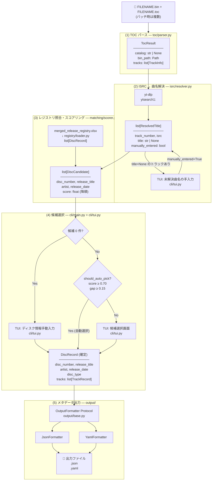
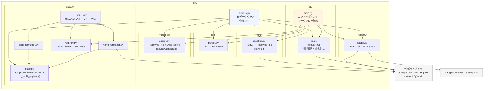
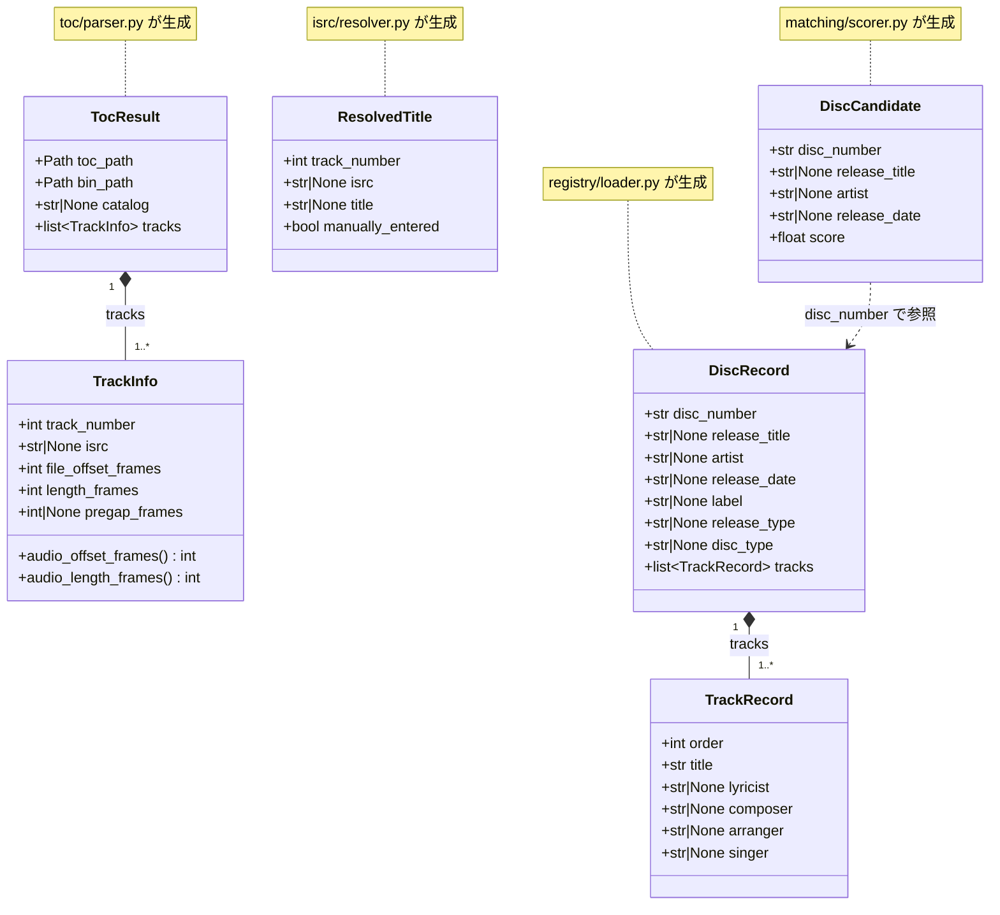

# Architecture: cdrdao-processor

cdrdao でリッピングした CD イメージ（`.bin` + `.toc`）に対して、YouTube 検索で取得した曲名と `merged_release_registry.xlsx` のリリース情報を照合し、ディスクのタイトルや曲のメタデータを付与するパイプライン。

> **注意**: リポジトリ内の既存 `.py` ファイル群は技術検証用の PoC コードである。  
> 本番実装はこれらを直接 import せず、設計・アルゴリズムの参考として扱う。

---

## 全体データフロー

パイプラインは 5 つのステップで構成される。各ステップの出力が次のステップの入力になる。

```
[FILENAME.bin + FILENAME.toc]  (バッチ時は複数)
          |
          | (1) TOC パース
          v
   [TocResult]  — カタログ番号・トラック一覧(ISRC・オフセット等)
          |
          | (2) ISRC → 曲名解決 (yt-dlp)
          |     未解決トラックは TUI で手入力補完
          v
   [list[ResolvedTitle]]  — トラックごとの曲名(解決済み or None)
          |
          | (3) レジストリ照合・スコアリング
          v
   [list[DiscCandidate]]  スコア降順
          |
          | (4) 候補選択 (自動選択 or TUI)
          |     候補0件の場合: TUI でディスク情報を手動入力
          v
   [DiscRecord]  確定したディスク情報
          |
          | (5) メタデータ出力 (OutputFormatter Protocol)
          v
   [出力ファイル]  JSON / YAML / ... (フォーマットはプラグイン式)
```

### データフロー図



---

## モジュール構成

各モジュールは単一責任を持つ。モジュール間の依存は `cli/main.py` のみが持ち、他のモジュールは互いに import しない。データの受け渡しは共有 dataclass (`models.py`) を通じて行う。

```
src/
├── models.py              # 共有データクラス定義 (依存なし)
├── toc/
│   └── parser.py          # .toc ファイルパース → TocResult
├── isrc/
│   └── resolver.py        # ISRC → 曲名解決 (yt-dlp)
├── registry/
│   └── loader.py          # merged_release_registry.xlsx 読込 → list[DiscRecord]
├── matching/
│   └── scorer.py          # 曲名リスト照合 → list[DiscCandidate]
├── output/
│   ├── base.py            # OutputFormatter Protocol 定義
│   ├── json_formatter.py  # JSON 出力
│   ├── yaml_formatter.py  # YAML 出力
│   └── registry.py        # フォーマット名 → Formatter のレジストリ
└── cli/
    ├── main.py            # エントリポイント・ワークフロー結合
    └── tui.py             # textual ベースの TUI (候補選択・曲名補完)
```

### モジュール依存関係図



---

## 共有データクラス (`models.py`)

すべてのモジュールが参照する型定義。このファイル自体は他のモジュールを import しない。パイプラインの各ステップ間で受け渡されるデータ構造を定義する。

### データクラス関係図



### データクラス説明

**TOC パース結果**

- `TrackInfo`: 1トラック分の物理情報。BIN ファイル内のオフセット・長さ・プリギャップをフレーム単位で保持する。`audio_offset_frames` / `audio_length_frames` プロパティでプリギャップを除いた実音声位置を算出できる。
- `TocResult`: ディスク全体のパース結果。`bin_path` は `toc_path` と同名・同ディレクトリの `.bin` を指す（命名規則による自動解決）。

**曲名解決結果**

- `ResolvedTitle`: トラックごとの曲名解決結果。`title` が `None` の場合は解決不能（ISRC なし・yt-dlp 空振り）。`manually_entered` フラグで TUI 手入力とシステム解決を区別する。

**レジストリ読込結果**

- `TrackRecord`: レジストリ上の1トラック分のメタデータ。作詞/作曲/編曲/歌唱者を保持する。
- `DiscRecord`: レジストリ上のディスク単位の情報。品番・リリースタイトル・アーティスト・発売日・盤種を持ち、`tracks` にトラック一覧を内包する。

**マッチング結果**

- `DiscCandidate`: スコアリングで算出した候補ディスク。`score` は 0.0〜1.0 の類似度。`disc_number` を介して `DiscRecord` と紐付く。

---

## モジュール詳細

### `toc/parser.py` — TOC パーサ

**責務**: cdrdao が生成した `.toc` ファイルをパースし `TocResult` を返す。

**設計上の考え方**:
- `bin_path` はファイル名から自動解決する（`toc_path` と同名・同ディレクトリの `.bin`）。呼び出し側が BIN パスを指定する必要はない。
- CD_DA 以外のフォーマットは処理対象外としてエラーを送出する。
- 入力: `.toc` ファイルパス / 出力: `TocResult`

**TOC 行の解釈方針**:

| TOC 行 | 処理 |
|---|---|
| `CD_DA` | フォーマット確認。他フォーマットはエラー |
| `CATALOG "..."` | ディスクの MCN/UPC として記録 |
| `TRACK AUDIO` | 新トラック開始。前トラックを確定してバッファをリセット |
| `ISRC "..."` | 現在トラックの ISRC として記録 |
| `FILE "name" <offset> <length>` | オフセット・長さのみ使用。ファイル名は無視し `bin_path` は toc_path から決定 |
| `START <msf>` | プリギャップ長として記録 |
| その他フラグ行・コメント行・空行 | 無視 |

**MSF ↔ フレーム変換の規則**:
- `MM:SS:FF` 形式 → `(MM×60 + SS)×75 + FF` フレーム
- 1秒 = 75フレーム、1フレーム = 2352バイト（44100Hz・16bit・2ch）

---

### `isrc/resolver.py` — ISRC → 曲名解決

**責務**: トラック一覧の ISRC を使って YouTube 検索（yt-dlp）を行い、曲名を解決する。

**設計上の考え方**:
- ISRC が `None` または空のトラックはネットワーク呼び出しをせず `title=None` として返す。
- yt-dlp が結果を返さなかった場合も `title=None`。曲名が解決できなかったことを「エラー」とは扱わない。
- ネットワークエラー・yt-dlp 内部エラーは例外として伝播させ、呼び出し側で対処する。
- 入力: `list[TrackInfo]` / 出力: `list[ResolvedTitle]`

**曲名フィールドの優先順位**（yt-dlp レスポンス内）:

```
entry["track"]  →  entry["title"]  →  entry["alt_title"]  →  entry["music"]["track"]
```

---

### `registry/loader.py` — レジストリ読込

**責務**: `merged_release_registry.xlsx` を読み込み、品番（Disc Number）単位でグルーピングした `list[DiscRecord]` を返す。

**設計上の考え方**:
- 必須列（Disc Number・Track Order・Track Title）が欠落している場合はエラーとする。
- 同一キー（Disc Number + Track Order）が重複する場合は先行行を優先し、警告を出力する。
- Track Order は数値として扱う（文字列のまま比較しない）。
- 入力: XLSX ファイルパス / 出力: `list[DiscRecord]`

**XLSX スキーマ**:

| 列名 | 必須 | 説明 |
|---|---|---|
| `Disc Number` | 必須 | 品番（例: `EPCE-7845`） |
| `Track Order` | 必須 | トラック番号（1始まり） |
| `Track Title` | 必須 | 曲タイトル |
| `Release Title` | 任意 | アルバム/シングルタイトル |
| `Artist` | 任意 | アーティスト名 |
| `Release Date` | 任意 | 発売日（YYYY/MM/DD） |
| `Label` | 任意 | レーベル |
| `Release Type` | 任意 | `single` / `album` |
| `Disc Type` | 任意 | 通常盤/初回限定盤 等 |
| `Lyricist` | 任意 | 作詞者 |
| `Composer` | 任意 | 作曲者 |
| `Arranger` | 任意 | 編曲者 |
| `Singer` | 任意 | 歌唱者 |

---

### `matching/scorer.py` — 照合・スコアリング

**責務**: 解決済み曲名リストとレジストリ全件を照合し、`DiscCandidate` のスコア降順リストを返す。

**設計上の考え方**:
- スコアリングは純粋な計算処理であり、外部 I/O を持たない。
- `ScorerConfig` でフィルタリング閾値・自動選択条件をすべて外部から注入できる（デフォルト値あり）。
- スコアが低すぎる候補は結果から除外し、ノイズを抑える。
- 入力: `list[ResolvedTitle]` + `list[DiscRecord]` / 出力: `list[DiscCandidate]`（スコア降順）

**スコアリングアルゴリズム**:

1. **タイトル正規化**: Unicode NFKC 正規化・casefold・記号類除去を行い、表記ゆれを吸収する。
2. **位置ベーススコア**: 解決済み曲名リストとレジストリのトラックリストを位置順に比較する。
   - 完全一致（正規化後）: 1.0点
   - 片方が他方を包含: 0.5点
   - `title=None` または正規化後が空文字: 比較対象から除外（分母・分子ともにカウントしない）
3. **長さペナルティ**: 解決済みリストとレジストリのトラック数が異なる場合にスコアを減衰させる。
4. **候補フィルタリング**: 絶対閾値・ベストスコアに対する相対閾値・上位 K 件でフィルタリングする。

**自動選択条件** (`should_auto_pick`):
- 1位候補のスコアが閾値（デフォルト: 0.70）以上、かつ
- 1位と2位のスコア差が閾値（デフォルト: 0.15）以上

どちらかを満たさない場合、または `--no-auto-pick` 指定時は TUI で選択させる。

---

### `output/` — メタデータ出力（プラグイン式）

**責務**: 確定した `DiscRecord` と `TocResult` からメタデータファイルを生成する。

**設計上の考え方**:
- `OutputFormatter` は Protocol（構造的部分型）として定義する。継承を要求せず、`format_name` / `file_extension` / `write()` を持つクラスならどれでも利用できる。
- フォーマットの追加は `output/registry.py` の `register()` に渡すだけでよい。`cli/main.py` の変更は不要。
- 出力ファイル名の命名規則: `<disc_number><file_extension>`（例: `EPCE-7845.json`）
- JSON と YAML は同一のデータ構造（`_build_payload` で生成）を異なるシリアライズで出力する。

**出力スキーマ（JSON / YAML 共通）**:

```
source
  toc_path        — パース元 .toc ファイルのパス
  bin_path        — toc_path と同名・同ディレクトリの .bin
  catalog         — MCN（null = CATALOG 行なし）

disc
  disc_number     — 品番
  release_title   — アルバム/シングルタイトル
  artist          — アーティスト名
  release_date    — 発売日（ISO 8601、null = 不明）
  label           — レーベル
  release_type    — "single" | "album" | null
  disc_type       — 通常盤/初回限定盤 等（null = 不明）

tracks[]
  track_number    — トラック番号
  isrc            — ISRC（null = なし）
  title           — 曲名
  lyricist        — 作詞者（null = 不明）
  composer        — 作曲者（null = 不明）
  arranger        — 編曲者（null = 不明）
  singer          — 歌唱者（null = 不明）
  manually_entered — true = TUI で手入力した曲名を使用
  bin_offset
    file_offset_frames  — BIN 内オフセット（プリギャップ含む）
    audio_offset_frames — プリギャップ除き実音声開始フレーム
    audio_length_frames — 実音声長フレーム
    audio_offset_msf    — MM:SS:FF 形式
    audio_length_msf    — MM:SS:FF 形式
```

---

### `cli/tui.py` — TUI（textual）

**責務**: 候補選択と未解決曲名の手入力補完を textual ベースの TUI で提供する。

**設計上の考え方**:
- TUI は純粋な I/O レイヤーとして機能し、ビジネスロジック（スコアリング等）を持たない。
- 曲名を手入力した場合は `manually_entered=True` を付与したうえでスコアリングを再実行し、候補選択画面に戻る（ループ）。
- ユーザーがキャンセルした場合は `None` を返し、`main.py` が `[SKIP]` として処理する。

**画面 1: DiscCandidate 選択**

候補が複数ある、または `--no-auto-pick` 指定時に表示する。

```
┌─ ディスク候補を選択 ────────────────────────────────────────────────────────┐
│  TOC: tocs/EPCE-7845.toc   解決済み曲名: 7/8 トラック                       │
│                                                                             │
│  候補                    スコア  アーティスト     発売日                    │
│ ▶ EPCE-7845  アルバム名  0.875  アーティスト名  2024-03-27                  │
│   EPCE-7846  別タイトル  0.512  別アーティスト  2023-11-15                  │
│   ESCL-5918  ...         0.320  ...             ...                         │
│                                                                             │
│  [Enter] 選択  [q] キャンセル                                               │
└─────────────────────────────────────────────────────────────────────────────┘
```

- 矢印キーで候補を移動、Enter で確定
- q / Escape でキャンセル → 終了コード 5

**画面 2: 未解決曲名の手入力**

`title=None` のトラックが存在する場合、候補選択の前に表示する。

```
┌─ 未解決の曲名を入力 ────────────────────────────────────────────────────────┐
│  ISRC のない、または検索が空振りしたトラックの曲名を入力してください。       │
│  空のままにすると、そのトラックはスコアリングから除外されます。              │
│                                                                             │
│  Track 03  ISRC: JPB602300003  yt-dlp: (空振り)                            │
│  曲名: [___________________________]                                        │
│                                                                             │
│  Track 07  ISRC: (なし)                                                     │
│  曲名: [___________________________]                                        │
│                                                                             │
│  [Enter] 確定  [Tab] 次のフィールド  [q] スキップして続行                   │
└─────────────────────────────────────────────────────────────────────────────┘
```

- 入力された曲名は `manually_entered=True` として扱い、スコアリングを再実行する
- q でスキップした場合は `title=None` のまま処理を続行する

**画面 3: 未登録ディスクの手動入力**

スコアリング結果が0件（レジストリに該当なし）の場合に表示する。

```
┌─ レジストリ未登録: ディスク情報を入力 ─────────────────────────────────────┐
│  このディスクはレジストリに見つかりませんでした。                            │
│  情報を入力すると出力ファイルを生成できます。空欄のままにした項目は null    │
│  として出力されます。[q] でスキップします。                                  │
│                                                                             │
│  品番 (Disc Number):  [___________________________]  ← 必須                │
│  リリースタイトル:    [___________________________]                         │
│  アーティスト:        [___________________________]                         │
│  発売日 (YYYY-MM-DD): [___________________________]                         │
│  レーベル:            [___________________________]                         │
│  リリース種別:        [single / album / ___________]                        │
│  盤種:                [___________________________]                         │
│                                                                             │
│  ── トラック ──────────────────────────────────────────────────────────── │
│  Track 01  ISRC: JPB602300001  yt-dlp: "曲名A"  曲名: [曲名A_______]      │
│  Track 02  ISRC: JPB602300002  yt-dlp: (空振り) 曲名: [___________]       │
│  Track 03  ISRC: (なし)                          曲名: [___________]       │
│                                                                             │
│  [Enter] 確定  [Tab] 次のフィールド  [q] スキップして終了                   │
└─────────────────────────────────────────────────────────────────────────────┘
```

- 品番（Disc Number）は必須。空欄のまま確定しようとした場合はエラーメッセージを表示し、入力に留まる。
- トラック曲名フィールドは yt-dlp 解決済みの曲名をデフォルト値として表示する。
- 確定すると `DiscRecord` を直接構築してステップ (5) に進む（レジストリへの書き戻しは行わない）。
- q / Escape でキャンセルした場合は `[SKIP]` として終了する。

---

### `cli/main.py` — エントリポイント

**責務**: 各モジュールをワークフロー順に結合する唯一のオーケストレーター。

**設計上の考え方**:
- `main.py` だけが全モジュールを知っている。他のモジュールは互いを参照しない。
- レジストリの読込はバッチ処理開始前に一度だけ行い、全ディスクで共有する。
- 自動選択できたディスクは TUI を表示しない。

**CLI 引数**:

```
uv run python -m cli.main [options]

入力ソース (いずれか1つ必須):
  --toc PATH         .toc ファイルを指定 (単体モード)
  --dir PATH         ディレクトリを指定 (バッチモード: 配下の .toc を全処理)

オプション:
  --registry PATH    レジストリ XLSX のパス (デフォルト: merged_release_registry.xlsx)
  --output PATH      出力先ディレクトリ (デフォルト: --toc / --dir と同じ場所)
  --format NAME      出力フォーマット (デフォルト: json)
  --formats          利用可能なフォーマット一覧を表示して終了
  --isrc-only        ISRC を表示して終了 (単体モードのみ)
  --no-auto-pick     常に TUI 選択画面を表示する
  --toc-encoding ENC TOC ファイルのエンコーディング (デフォルト: utf-8)
```

**単体モードの処理フロー**:

1. `toc/parser.py` で `.toc` をパースし `TocResult` を得る
2. `isrc/resolver.py` で ISRC → 曲名解決し `list[ResolvedTitle]` を得る
3. 未解決トラック（`title=None`）があれば TUI で手入力補完し再スコアリング
4. `matching/scorer.py` でレジストリ全件と照合し `list[DiscCandidate]` を得る
5. 候補が0件の場合は TUI（画面3）でディスク情報を手動入力し `DiscRecord` を構築。キャンセルなら `[SKIP]` として終了
6. 候補がある場合、自動選択条件を満たすかつ `--no-auto-pick` なしであれば自動選択、そうでなければ TUI で選択
7. TUI キャンセルなら `[SKIP]` として終了
8. 確定した `DiscRecord` を `formatter.write()` で出力

**バッチモードの処理フロー**:

`--dir` モードでは配下の `.toc` ファイルを順番に処理し、ディスクごとに上記フローを実行する。

```
[1/5] EPCE-7845.toc  → 自動選択: EPCE-7845 (score=0.875)
[2/5] EPCE-7846.toc  → TUI: 候補選択
[3/5] ESCL-5918.toc  → TUI: 未解決曲名入力 → 候補選択
[4/5] UFCW-1091.toc  → TUI: 候補0件 → ディスク情報手動入力
[5/5] UFCW-1166.toc  → 自動選択: UFCW-1166 (score=0.800)
```

---

## ファイル・ディレクトリ構成（本番実装）

```
cdrdao-processor/
├── src/
│   ├── models.py
│   ├── toc/
│   │   └── parser.py
│   ├── isrc/
│   │   └── resolver.py
│   ├── registry/
│   │   └── loader.py
│   ├── matching/
│   │   └── scorer.py
│   ├── output/
│   │   ├── __init__.py        # 組み込みフォーマットを登録
│   │   ├── base.py            # OutputFormatter Protocol + _build_payload
│   │   ├── json_formatter.py
│   │   ├── yaml_formatter.py
│   │   └── registry.py
│   └── cli/
│       ├── main.py
│       └── tui.py
│
├── tests/
│   ├── test_toc_parser.py
│   ├── test_scorer.py
│   ├── test_registry_loader.py
│   ├── test_isrc_resolver.py  # yt-dlp はモック
│   └── test_output_formatters.py
│
├── tocs/                        # サンプル .toc ファイル (開発用)
├── merged_release_registry.xlsx # リリースレジストリ (生成物)
│
│   # ── PoC コード (参照のみ・src/ から import 不可) ──
├── toc_parser.py
├── isrc_disc_matcher.py
├── minc_parser.py
├── product_number_detector.py
├── upfront_release_parser.py
├── upfront_release_sqlite.py
├── fix_toc_filenames.py
│   # ────────────────────────────────────────────────
│
├── .env                         # 認証情報 (ローカルのみ; .env.example を参照)
├── pyproject.toml               # Python >= 3.14
└── uv.lock
```

---

## 外部依存ライブラリ

| ライブラリ | 用途 | モジュール |
|---|---|---|
| `yt-dlp` | YouTube 検索による曲名解決 | `isrc/resolver.py` |
| `pandas` + `openpyxl` | XLSX レジストリ読込 | `registry/loader.py` |
| `textual` | TUI（候補選択・曲名補完） | `cli/tui.py` |
| `PyYAML` | YAML 出力 | `output/yaml_formatter.py` |

---

## 将来の拡張方針

### 新フォーマットの追加方法

`OutputFormatter` Protocol を満たすクラスを作成し、`output/registry.py` の `register()` に渡すだけで追加できる。`cli/main.py` の変更は不要。`format_name` / `file_extension` / `write()` の 3 つを実装するだけでよい。

### レジストリ更新の自動化

`merged_release_registry.xlsx` の生成は現状手動実行が必要。PoC `upfront_release_parser.py` のスクレイピングロジックを参考に、増分更新に対応した別スクリプトとして実装する。
